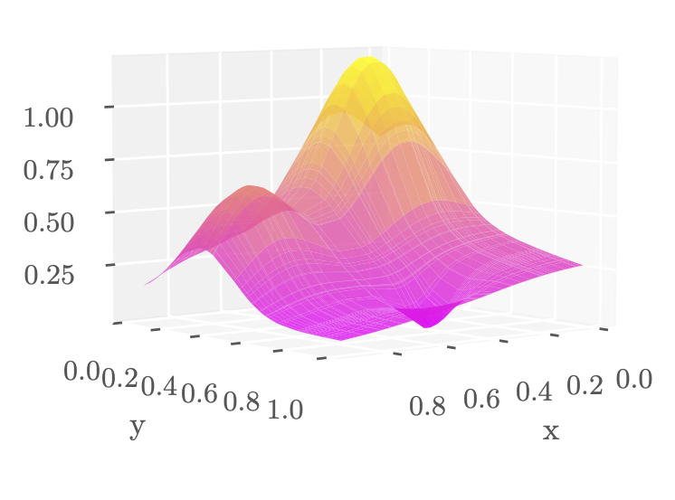
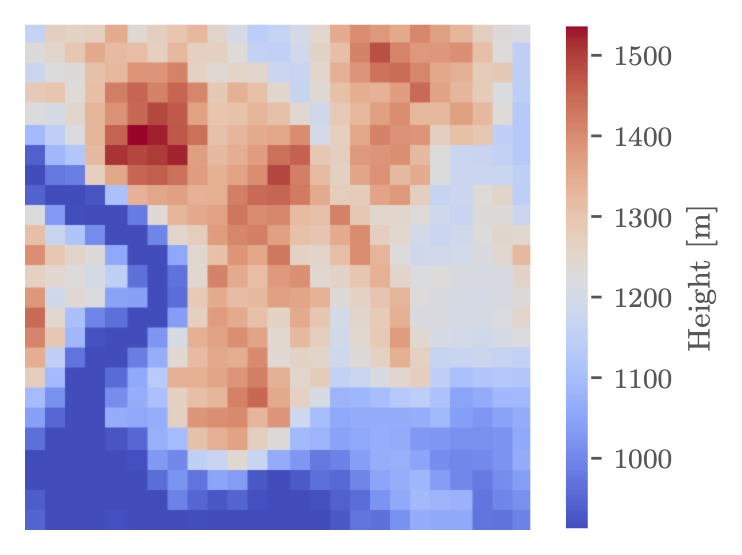

# Regression Analysis and Resampling Methods
In this project we focus on three regression models: Ordinary Least Squares, Ridge regression, and Lasso regression. We test them on both synthetic data and real life terrain data collected from [earthexplorer.usgs.gov](https://earthexplorer.usgs.gov/). 
*Bootstrapping* and *K-fold cross validation* are used to improve the statistical accuracy of the analysis. 

  
  

## Results
On the synthetic data OLS performed the best out of the three with an MSE of $3.7 \times 10^{-4}$ when using a polynomial degree of $8$. For the terrain data OLS also outperformed the two other models. It achieved an MSE of $5253.97$ with the same optimal polynmial degree of $8$.
However, when the terrain data was properly scaled, Ridge regression performed the best with an MSE of $1.6 \times 10^{-1}$ when used with the polynomial degree of $15$ and regularization parameter $\lambda = 10^{-6}$

## Structure
The repository contains three subdirectories and one pdf:
- **src** - Containing all code
    - **franke_plots.ipynb** - All plots for Franke function.
    - **terrain_plots.ipynb** - All plots for terrain data.
    - **general_functions.py** - Functions for calculations.
    - **plotting_functions.py** - Functions for plotting results. 
- **figures**      - Containing all plots generated by the code.
- **datasets**      - Containing the terraindata used in the project.
- **project1_report** - Contains the pdf of the report.

The two .ipynb files (**franke_plots.ipynb** and **terrain_plots.ipynb**) located in **src/** are the main files responsible for generating plots. While **general_functions.py** and **plotting_functions.py** contain all functions used by the .ipynb files.
