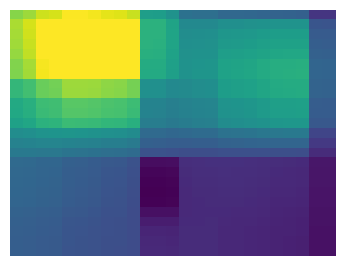
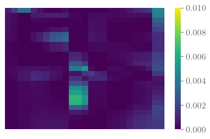
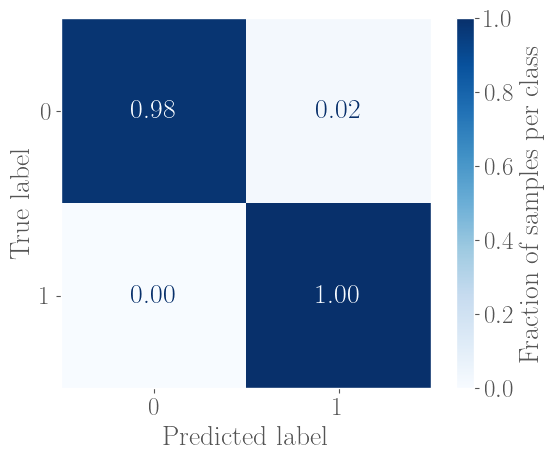
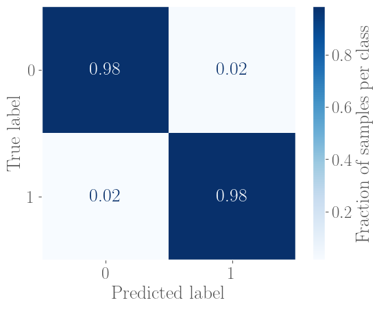

# Classification and Regression, from linear and logistic regression to neural networks

In this project we create a FFNN from scratch and use it on both regression of the Franke function, and classification of the [Breast Cancer Wisconsin (Diagnostic) Data Set](https://www.kaggle.com/datasets/uciml/breast-cancer-wisconsin-data). We use gridsearch parameter tuning to find the optimal parameters to achieve the optimal results. 

## Results
We got our FFNN to closely match or even outperform traditional regression and classification models, especially when fitted to the Franke function. When applied to regression, even though we achieved a MSE of $5.9 \times 10^{-4}$ the analytical OLS outperformed with an MSE of $3.7 \times 10^{-4}$. In classification, the FFNN achieved a perfrect false negative rate of $0.00$ and an overall accuracy of $0.99$. However, simpler models like Logistic regression also yielded competetive results with accuracies of $0.98$. 
### Regression

  

    <h4>Original</h4>
    
  

  

    <h4>FFNN Prediction</h4>
    
  

  

    <h4>MSE</h4>
    
  

### Classification

  

    <h3>FFNN</h3>
    
  

  

    <h3>Logistic Regression</h3>
    
  

### Final Parameters
|Parameters     |Linear Regression  |Classification |
|---            |---                |---            |
|Scheduler      |ADAM               |ADAM           |
|Learning rate  |0.001              |0.001          |
|Regularization |0                  |0.001          |
|N Nodes        |64                 |8              |
|N Layers       |4                  |2              |
|N Batches      |10                 |10             |

## Structure
 * **[figures/](./figures/)**    - Contains all figures generated by the code
 * **[src/](./src/)**        - Contains all code for the project
   > **Source code for generating results**
   > * [activation_functions.py](./src/activation_functions.py)
   > * [cost_functions.py](./src/cost_functions.py)
   > * [logistic_regression.py](./src/logistic_regression.py)
   > * [neural_network.py](./src/neural_network.py)
   > * [scheduler.py](./src/scheduler.py)

   > **Code used for generating plots**
   > * [plot_binary_classification.ipynb](./src/plot_binary_classification.ipynb)
   > * [plot_logistic_regression.ipynb](./src/plot_logistic_regression.ipynb)
   > * [plot_regression.ipynb](./src/plot_regression.ipynb)
   > * [plot_theory_figures.ipynb](./src/plot_theory_figures.ipynb)
   > * [plotting.py](./src/plotting.py)
* **[README.md](./README.md)**
